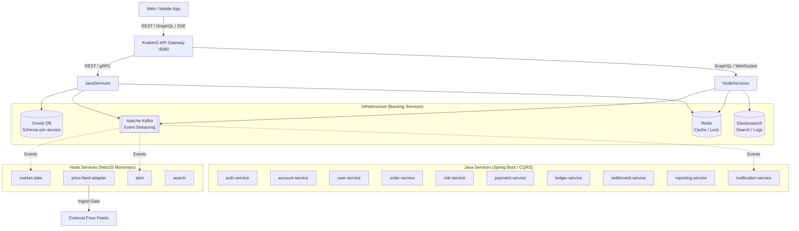

# 📈 Nền Tảng Giao Dịch Microservice (Trading Platform)

Một kiến trúc microservice polyglot, cấp độ production dành cho nền tảng giao dịch tài chính — được xây dựng bằng **Spring Boot (Java 21)** và **NestJS (Node 22)**, vận hành thông qua **Kubernetes** và **Docker Compose**, với **KrakenD** làm API Gateway.

---

## 📊 Nghiệp Vụ Kinh Doanh (Business Domains)

Nền tảng bao phủ **12 domain nghiệp vụ** với **~90+ use case**. Dưới đây là tóm tắt về từng domain và các luồng nghiệp vụ cốt lõi.

### 🔐 1. Xác thực & Phân quyền (Auth & RBAC)

> Quản lý danh tính, xác thực và kiểm soát truy cập dựa trên vai trò.

| Nhóm | Use Cases |
|-------|-----------|
| **Đăng ký & Đăng nhập** | Đăng ký tài khoản, Đăng nhập (email/password), Google OAuth2, Đăng xuất, Quên mật khẩu, Đổi mật khẩu |
| **2FA** | Bật 2FA (TOTP), Xác thực TOTP khi đăng nhập, Mã dự phòng (backup codes), Tắt 2FA |
| **RBAC** | Quản lý vai trò (Trader, Premium, Analyst, Compliance, Admin, Super Admin), Phân quyền tài nguyên+hành động+phạm vi, Gán/thu hồi vai trò |

**Quy tắc chính**: Khóa sau 5 lần đăng nhập sai • Access token 15 phút / Refresh token 30 ngày • 10 mã dự phòng khi bật 2FA • Yêu cầu Super Admin để thay đổi quyền Admin

---

### 👤 2. Hồ sơ & KYC (User Profile & KYC)

> Quản lý thông tin cá nhân và xác minh danh tính theo yêu cầu pháp lý.

| Nhóm | Use Cases |
|-------|-----------|
| **Hồ sơ cá nhân** | Cập nhật thông tin, Ảnh đại diện, Quản lý thiết bị tin cậy |
| **KYC** | Nộp hồ sơ (CMND/CCCD/Hộ chiếu + Selfie), Xét duyệt thủ công, Nộp lại sau khi bị từ chối, Giới hạn tính năng theo mức KYC |

**Quy tắc chính**: Khóa Tên/Ngày sinh sau khi KYC thành công • Tối đa 3 lần nộp lại • KYC đang chờ = chỉ xem • KYC bị từ chối = chỉ rút tiền • SLA xét duyệt: 2 ngày làm việc

---

### 💰 3. Tài khoản & Dòng tiền (Account & Money)

> Nạp/rút, quản lý số dư, tài khoản margin và biểu phí.

| Nhóm | Use Cases |
|-------|-----------|
| **Nạp & Rút tiền** | Nạp tiền (ngân hàng/thẻ/ví điện tử), Rút tiền (về ngân hàng đã xác minh), Quản lý tài khoản ngân hàng |
| **Quản lý số dư** | Xem số dư (khả dụng/đang giữ/margin), Phong tỏa tài khoản, Lịch sử giao dịch tiền |
| **Margin** | Đăng ký margin (tối thiểu 10 triệu VND), Sử dụng margin (1:2 → 1:5), Phí margin hàng ngày |
| **Phí & Hoa hồng** | Biểu phí theo cấp độ (0.2% → 0.1%), Hoàn phí cho Market Maker |

**Quy tắc chính**: Nạp tối thiểu 100K VND • Chỉ rút về ngân hàng đã xác minh (tên phải khớp KYC) • Tối đa 3 tài khoản ngân hàng • Khả dụng = tổng − đang giữ − đang rút • Lưu trữ dữ liệu tài chính 10 năm

---

### 📋 4. Đặt lệnh (Order Management)

> Toàn bộ vòng đời của lệnh từ khi đặt đến khi hoàn thành hoặc bị hủy.

| Nhóm | Use Cases |
|-------|-----------|
| **Đặt lệnh** | Lệnh Thị trường, Lệnh Giới hạn, Dừng lỗ (Stop-Loss), Stop-Limit, Chỉnh sửa lệnh, Hủy lệnh, Hủy tất cả |
| **Quy tắc giao dịch** | Giờ giao dịch (9:00-11:30, 13:00-14:30), Biên độ giá (±7%), Lô tối thiểu (100 CP), Kiểm tra T+2 |
| **Lịch sử** | Theo dõi trạng thái realtime (PENDING→OPEN→PARTIAL→FILLED/CANCELLED), Lịch sử lệnh, Chi tiết khớp lệnh |

**Quy tắc chính**: Biên độ giá ±7% (mã mới niêm yết ±20% trong 3 phiên đầu) • Lô tối thiểu 100 cổ phiếu • Cổ phiếu mua ngày T chỉ được bán ở T+2 • Sửa giá/tăng số lượng = mất thứ tự ưu tiên • Lưu lịch sử lệnh 5 năm

---

### ⚡ 5. Khớp lệnh (Order Matching)

> Quản lý sổ lệnh, khớp lệnh ưu tiên giá-thời gian và các phiên giao dịch đặc biệt.

| Nhóm | Use Cases |
|-------|-----------|
| **Cơ chế khớp** | Ưu tiên Giá-Thời gian (FIFO), Khớp một phần, Quản lý sổ lệnh |
| **Phiên đặc biệt** | ATO (9:00-9:15, giá chung), ATC (14:15-14:30, giá đóng cửa), Tạm dừng giao dịch (Trading Halt), Circuit Breaker |

**Quy tắc chính**: Giá mua cao hơn = ưu tiên cao hơn • Cùng giá = FIFO • Giá ATC = giá tham chiếu cho ngày hôm sau • Circuit breaker: −5% trong 5 phút → dừng 10 phút, −10% trong phiên → dừng cả ngày

---

### 🛡️ 6. Quản lý Rủi ro (Risk Management)

> Kiểm tra trước giao dịch, quản lý margin call và phát hiện bất thường.

| Nhóm | Use Cases |
|-------|-----------|
| **Trước giao dịch** | Kiểm tra số dư (Sức mua), Giới hạn vị thế (tối đa 5% tổng lưu hành), Giới hạn tỷ lệ lệnh (50 lệnh/phút), Kiểm tra giờ & trạng thái mã |
| **Margin Call** | Cảnh báo (tỷ lệ <150% → email, <120% → SMS), Thanh lý bắt buộc (<100%), Lịch sử Margin Call |
| **Giám sát** | Phát hiện bất thường (wash trading, pump&dump), Giới hạn lỗ trong ngày (>20% NAV) |

**Quy tắc chính**: Từ chối ngay nếu không đủ tiền • Tối đa 50 lệnh/phút, 500 lệnh/ngày (Trader) • Margin <100% = tự động thanh lý (ưu tiên mã thanh khoản cao nhất) • Có 24h để phản hồi margin call

---

### ✅ 7. Thanh toán bù trừ (Settlement)

> Thanh toán T+2, DVP (Giao chứng khoán thanh toán tiền) và đối soát.

| Nhóm | Use Cases |
|-------|-----------|
| **Settlement** | Xác nhận giao dịch (<1 phút), Thanh toán T+2, DVP, Xử lý Settlement thất bại |
| **Đối soát** | Đối soát cuối ngày (20:00 tự động), Báo cáo settlement |

**Quy tắc chính**: T+2 không tính cuối tuần/ngày lễ • DVP: chuyển đồng thời hoặc rollback toàn bộ • Phạt thất bại settlement: 0.5% • Mua bù từ thị trường nếu người bán không giao cổ phiếu • Lưu hồ sơ đối soát 10 năm

---

### 📈 8. Danh mục Đầu tư (Portfolio)

> Theo dõi tài sản, tính toán lãi/lỗ (P&L) và phân tích hiệu suất.

| Nhóm | Use Cases |
|-------|-----------|
| **Theo dõi** | Nắm giữ (sẵn sàng vs đang chờ settlement), Lãi/lỗ chưa thực hiện (realtime), Lãi/lỗ đã thực hiện (sau khi bán), Hiệu suất theo thời gian (so với chỉ số VN-Index) |
| **Phân tích** | Phân bổ tài sản (cảnh báo nếu >30% cho 1 cổ phiếu), Lịch sử giao dịch danh mục |

**Quy tắc chính**: Giá vốn = trung bình gia quyền • Lãi/lỗ đã thực hiện = (bán − giá vốn TB) × số lượng − phí • Chỉ số: Lợi nhuận Ngày/Tháng/Năm, Tỷ lệ Sharpe, Max Drawdown

---

### 📊 9. Dữ liệu Thị trường (Market Data)

> Giá realtime, dữ liệu lịch sử, tin tức và cảnh báo giá.

| Nhóm | Use Cases |
|-------|-----------|
| **Realtime** | Giá realtime (bid/ask/last/volume, mỗi 1s), Sổ lệnh (10-20 mức), Khớp lệnh gần nhất (50-100 lệnh), Thống kê 24h |
| **Lịch sử** | Biểu đồ nến (1m→1M, lưu trữ 5 năm), Chỉ báo kỹ thuật (MA, RSI, MACD, Bollinger), Dữ liệu cơ bản (P/E, EPS) |
| **Tin tức** | Tin tức thị trường (tìm kiếm toàn văn), Lịch sự kiện doanh nghiệp, Cảnh báo giá (tối đa 20 cảnh báo đang bật/người dùng) |

**Quy tắc chính**: WebSocket để theo dõi nhiều mã cùng lúc • Tối đa 1000 nến/yêu cầu • Điều chỉnh dữ liệu lịch sử khi có sự kiện doanh nghiệp • Cảnh báo giá trong vòng 5 giây

---

### 📄 10. Báo cáo & Thuế (Reporting & Tax)

> Sao kê tài khoản, báo cáo giao dịch và hỗ trợ kê khai thuế.

| Nhóm | Use Cases |
|-------|-----------|
| **Sao kê** | Sao kê tài khoản (tháng/quý/năm), Lịch sử giao dịch chi tiết, Báo cáo danh mục (ảnh chụp lịch sử) |
| **Thuế** | Tổng hợp thu nhập chịu thuế (0.1% trên giá trị giao dịch), Xuất chứng từ nộp thuế, Thông báo cổ tức (thuế tại nguồn 5%) |

**Quy tắc chính**: Tự động gửi email sao kê hàng tháng • Xuất PDF/CSV • Chứng từ thuế theo định dạng của Bộ Tài chính • Lưu hồ sơ thuế 10 năm

---

### 🔔 11. Thông báo (Notification)

> Thông báo đa kênh với hệ thống quản lý tùy chọn của người dùng.

| Nhóm | Use Cases |
|-------|-----------|
| **Loại thông báo** | Giao dịch (đặt/khớp/hủy), Tài khoản (nạp/rút/đăng nhập đáng ngờ), Giá & Thị trường (cảnh báo giá), Rủi ro (margin call, thanh lý bắt buộc) |
| **Quản lý** | Cài đặt kênh (email/push/SMS), Lịch sử thông báo (90 ngày) |

**Quy tắc chính**: Không thể tắt thông báo bảo mật • SMS yêu cầu đăng ký trả phí • Margin call = gửi đồng thời qua tất cả các kênh • Tối đa 1 thông báo trùng lặp/giờ • Lịch sử thông báo 90 ngày (audit log lưu vĩnh viễn)

---

### ⚙️ 12. Quản trị (Admin / Back Office)

> Công cụ nội bộ dành cho vận hành, tuân thủ pháp lý và quản lý nền tảng.

| Nhóm | Use Cases |
|-------|-----------|
| **Quản lý người dùng** | Tìm kiếm hồ sơ, Phong tỏa/Mở phong tỏa, Điều chỉnh số dư thủ công (nguyên tắc 4 mắt) |
| **Vận hành thị trường** | Quản lý mã (thêm/sửa/dừng), Điều chỉnh biên độ giá, Circuit Breaker thủ công |
| **Giám sát** | Dashboard realtime (làm mới mỗi 5s), Báo cáo doanh thu & phí, Audit Log toàn hệ thống |

**Quy tắc chính**: Điều chỉnh số dư yêu cầu 2 người phê duyệt (4-eyes) • Audit log không thể thay đổi (ngay cả Super Admin cũng không thể xóa) • Lưu trữ Audit log: 7 năm • Mọi lượt xem hồ sơ bởi Admin đều được ghi log

---

## 🏗️ Tổng Quan Kiến Trúc (Architecture Overview)



Tất cả các dịch vụ giao tiếp qua mạng Docker bridge `trading-net`. Giao tiếp giữa các dịch vụ sử dụng **Kafka** (event-driven), **gRPC** (đồng bộ), và **GraphQL** (query federation).

---

## 📁 Cấu Trúc Dự Án (Project Structure)

```text
microservice-full-prod/
├── java-services/                # Microservices Spring Boot (Gradle multi-project)
│   ├── common-service/           # Thư viện chung (CQRS, persistence patterns)
│   ├── auth-service/             # Xác thực & Phân quyền
│   ├── account-service/          # Quản lý tài khoản
│   ├── payment-service/          # Xử lý thanh toán
│   ├── ledger-service/           # Sổ cái kép / Kế toán
│   ├── order-service/            # Quản lý vòng đời lệnh giao dịch
│   ├── risk-service/             # Kiểm soát & Đánh giá rủi ro
│   ├── settlement-service/       # Thanh toán bù trừ
│   ├── notification-service/     # Thông báo (SSE streaming)
│   ├── reporting-service/        # Báo cáo & Phân tích
│   ├── user-service/             # Quản lý hồ sơ người dùng
│   ├── project_template/         # Template cho dịch vụ Spring Boot
│   ├── quarkus_template/         # Template cho dịch vụ Quarkus
│   ├── build.gradle              # Cấu hình Gradle gốc (Java 21 toolchain)
│   └── settings.gradle           # Multi-project includes
│
├── node-services/                # Monorepo NestJS
│   ├── apps/
│   │   ├── market-data/          # Tổng hợp dữ liệu thị trường
│   │   ├── price-feed-adapter/   # Xử lý luồng giá realtime
│   │   ├── alert/                # Hệ thống cảnh báo theo quy tắc
│   │   └── search/               # Tìm kiếm toàn văn (Elasticsearch)
│   ├── libs/
│   │   ├── core/                 # Tiện ích cốt lõi & base classes
│   │   ├── web/                  # HTTP/Express helpers
│   │   ├── security/             # Auth guards & strategies
│   │   ├── validation/           # DTO validation pipes
│   │   ├── kafka/                # Kafka producer/consumer wrappers
│   │   ├── graphql/              # GraphQL module & resolvers
│   │   ├── grpc/                 # gRPC client/server helpers
│   │   ├── redis/                # Redis cache & pub/sub
│   │   ├── contract/             # DTO chung & giao thức inter-service
│   │   ├── audit/                # Ghi nhận Audit trail
│   │   ├── observability/        # Metrics, tracing, health checks
│   │   ├── idempotency/          # Xử lý yêu cầu Idempotent
│   │   └── lock/                 # Khóa phân tán (Distributed locking với Redis)
│   └── package.json
│
├── krakend-gateway/              # API Gateway
│   ├── krakend.json              # Định nghĩa Route
│   ├── Dockerfile
│   └── k8s/                      # K8s manifests cho gateway
│
├── proto/                        # Định nghĩa Protobuf chung (gRPC)
│
├── shared-config/                # Cấu hình dùng chung
│   ├── constants-shared.json     # HTTP & service response codes
│   ├── topic-shared.json         # Quy ước đặt tên Kafka topic
│   ├── endpoint-shared.json      # Endpoints của các dịch vụ nội bộ
│   ├── circuit-breaker-shared.json # Chính sách Circuit breaker
│   └── elastic-shared.json       # Cấu hình kết nối Elasticsearch
│
├── infra/                        # Hạ tầng & DevOps
│   ├── db-init/                  # Script khởi tạo Oracle DB
│   ├── helm/                     # Helm charts (ES, Kibana, Prometheus...)
│   ├── manifests/                # K8s manifests thô
│   ├── scripts/                  # Script khởi động Cluster
│   ├── helmfile.yaml             # Điều phối Helmfile
│   └── kind-config.yaml          # Cấu hình Kind cluster
│
├── docs/                         # Tài liệu hệ thống
├── docker-compose.yml            # Docker Compose full-stack
└── run.sh                        # Script chạy dự án đa chế độ
```

---

## ☕ Java Services

Tất cả các dịch vụ Java được xây dựng bằng **Spring Boot** trên **Java 21** sử dụng cấu trúc đa dự án **Gradle**. Dùng chung thư viện `common-service`.

### Cấu Trúc Gói Của Dịch Vụ

Mỗi dịch vụ tuân theo một cấu trúc tiêu chuẩn:

```text
com.<service>.app/
├── bean/               # Domain entities & value objects
├── bootstrap/          # Khởi tạo lúc startup
├── command/            # CQRS command bus (Command, Handler, Registry)
├── common/             # Exceptions dùng chung, response wrappers
├── config/             # Cấu hình App, Kafka, Redis, gRPC, CommandBus
├── constant/           # Hằng số chuyên biệt cho domain
├── controller/         # REST API endpoints
├── dao/                # Truy xuất dữ liệu (JPA repositories, mappers)
├── datacache/          # Tầng Cache
├── datasource/         # Tải cấu hình database & service
├── dto/                # Request/Response DTOs
├── executors/          # Async task executors
├── integration/        # External service clients
├── kafka/              # Kafka producers & consumers
├── process/            # Điều phối quy trình nghiệp vụ (Business process)
├── service/            # Domain services & logic nghiệp vụ
├── swagger/            # Tài liệu OpenAPI
├── utility/            # Sinh ID, các hàm tiện ích
└── validator/          # Input validation
```

### Các Mẫu Thiết Kế Chính (Design Patterns)

| Pattern | Triển khai |
|---------|---------------|
| **CQRS** | `Command` → `CommandBus` → `CommandHandler` cho từng use case |
| **Repository** | JPA repositories trong `dao/` cùng với persistence mappers |
| **Service Layer** | Domain services điều phối logic nghiệp vụ |
| **Strategy** | Interface `PaymentProvider` với `PaymentProviderRouter` |
| **Validation** | Validator chuyên biệt cho từng command |

---

## 🟢 Node Services

Được xây dựng như một **NestJS monorepo** với 13 thư viện chia sẻ cung cấp các concern cắt ngang (cross-cutting concerns).

### Ứng dụng (Apps)

| Ứng dụng | Mô tả | Dependencies Chính |
|-----|-------------|-----------------|
| `market-data` | Tổng hợp & cung cấp dữ liệu thị trường | Kafka, GraphQL, WebSocket |
| `price-feed-adapter` | Nạp luồng giá realtime từ nguồn ngoài | Kafka, gRPC |
| `alert` | Công cụ cảnh báo theo quy tắc | Redis, Kafka |
| `search` | Tìm kiếm toàn văn các thực thể | Elasticsearch |

---

## 🔌 Hạ Tầng (Infrastructure)

### Các Dịch Vụ Cốt Lõi (Backing Services)

| Dịch Vụ | Image | Port | Mục đích |
|---------|-------|------|---------|
| **Oracle DB** | `gvenzl/oracle-free:latest` | `1521` | Cơ sở dữ liệu quan hệ chính |
| **Apache Kafka** | `apache/kafka:latest` | `9092` | Event streaming (KRaft mode) |
| **Redis** | `redis:latest` | `6379` | Cache, pub/sub, khóa phân tán |
| **Elasticsearch** | `elasticsearch:8.12.2` | `9200` | Tìm kiếm toàn văn & gom log |
| **Kibana** | `kibana:8.12.2` | `5601` | Trực quan hóa log & dashboards |

### Lược Đồ CSDL (Database Schema)

Oracle sử dụng chiến lược cách ly **schema-per-service** (mỗi dịch vụ một schema riêng):
- `account_schema` — Các bảng của dịch vụ Account
- `order_schema` — Các bảng của dịch vụ Order
- Mỗi schema có thông tin đăng nhập và phân quyền độc lập

> 📝 **Chi tiết Database Schema**: Toàn bộ lược đồ cơ sở dữ liệu chi tiết cho 12 domain nghiệp vụ (bảng, cột, quan hệ) đã được định nghĩa tại file [`docs/schema.dbml`](./docs/schema.dbml). Dưới đây là sơ đồ ERD đầy đủ cho toàn bộ 12 domain:

```mermaid
erDiagram
    users ||--o{ bank_accounts : ""
    symbols ||--o{ settlements : ""
    market_news ||--o{ news_symbol_tags : ""
    trading_accounts ||--o{ ledger_entries : ""
    trading_accounts ||--o{ orders : ""
    symbols ||--o{ fundamental_data : ""
    symbols ||--o{ trading_sessions : ""
    trading_accounts ||--o{ settlements : ""
    users ||--o{ circuit_breaker_logs : ""
    trading_accounts ||--o{ manual_balance_adjustments : ""
    symbols ||--o{ news_symbol_tags : ""
    symbols ||--o{ market_ticks : ""
    trading_accounts ||--o{ portfolio_snapshots : ""
    trading_accounts ||--o{ tax_summaries : ""
    users ||--o{ audit_logs : ""
    risk_rules ||--o{ user_risk_overrides : ""
    users ||--o{ notifications : ""
    trading_accounts ||--o{ margin_interest_charges : ""
    symbols ||--o{ realized_pnl : ""
    users ||--o{ user_profiles : ""
    users ||--o{ password_reset_tokens : ""
    trading_accounts ||--o{ account_statements : ""
    trading_accounts ||--o{ holdings : ""
    trading_accounts ||--o{ anomaly_flags : ""
    users ||--o{ refresh_tokens : ""
    symbols ||--o{ price_alerts : ""
    symbols ||--o{ holdings : ""
    trading_accounts ||--o{ deposit_requests : ""
    users ||--o{ oauth_providers : ""
    users ||--o{ reconciliation_reports : ""
    symbols ||--o{ order_book_snapshots : ""
    orders ||--o{ forced_liquidations : ""
    symbols ||--o{ orders : ""
    roles ||--o{ user_roles : ""
    trading_accounts ||--o{ realized_pnl : ""
    users ||--o{ notification_preferences : ""
    symbols ||--o{ ohlcv_candles : ""
    trading_accounts ||--o{ withdrawal_requests : ""
    users ||--o{ backup_codes : ""
    trading_accounts ||--o{ forced_liquidations : ""
    users ||--o{ two_factor_auth : ""
    symbols ||--o{ corporate_events : ""
    bank_accounts ||--o{ withdrawal_requests : ""
    users ||--o{ kyc_submissions : ""
    users ||--o{ trading_accounts : ""
    symbols ||--o{ circuit_breaker_logs : ""
    order_fills ||--o{ realized_pnl : ""
    margin_call_logs ||--o{ forced_liquidations : ""
    users ||--o{ user_roles : ""
    users ||--o{ trusted_devices : ""
    trading_accounts ||--o{ margin_call_logs : ""
    symbols ||--o{ trade_records : ""
    users ||--o{ manual_balance_adjustments : ""
    orders ||--o{ order_amendments : ""
    users ||--o{ price_alerts : ""
    symbols ||--o{ forced_liquidations : ""
    roles ||--o{ role_permissions : ""
    users ||--o{ anomaly_flags : ""
    permissions ||--o{ role_permissions : ""
    users ||--o{ user_risk_overrides : ""
    orders ||--o{ order_fills : ""
    orders ||--o{ trade_records : ""
    trading_accounts ||--o{ account_balances : ""
    users ||--o{ login_attempts : ""
    trade_records ||--o{ settlements : ""

    users {
        bigserial id PK
        varchar_255 email
        varchar_255 password_hash
        varchar_20 status
        timestamp email_verified_at
        timestamp created_at
        timestamp updated_at
    }
    oauth_providers {
        bigserial id PK
        bigint user_id FK
        varchar_50 provider
        varchar_255 provider_uid
        timestamp created_at
    }
    refresh_tokens {
        bigserial id PK
        bigint user_id FK
        varchar_255 token_hash
        varchar_255 device_info
        varchar_45 ip_address
        timestamp expires_at
        timestamp revoked_at
        timestamp created_at
    }
    token_blacklist {
        bigserial id PK
        varchar_255 jti
        timestamp expires_at
        timestamp created_at
    }
    password_reset_tokens {
        bigserial id PK
        bigint user_id FK
        varchar_255 token_hash
        timestamp used_at
        timestamp expires_at
        timestamp created_at
    }
    two_factor_auth {
        bigserial id PK
        bigint user_id FK
        varchar_255 secret
        boolean enabled
        timestamp enabled_at
        timestamp created_at
    }
    backup_codes {
        bigserial id PK
        bigint user_id FK
        varchar_255 code_hash
        timestamp used_at
        timestamp created_at
    }
    login_attempts {
        bigserial id PK
        bigint user_id FK
        varchar_255 email
        varchar_45 ip_address
        boolean success
        timestamp attempted_at
    }
    trusted_devices {
        bigserial id PK
        bigint user_id FK
        varchar_255 device_fingerprint
        varchar_255 device_name
        varchar_45 ip_address
        timestamp last_seen_at
        timestamp created_at
    }
    roles {
        serial id PK
        varchar_50 name
        text description
    }
    permissions {
        serial id PK
        varchar_100 resource
        varchar_50 action
        varchar_20 scope
    }
    role_permissions {
        int role_id FK
        int permission_id FK
    }
    user_roles {
        bigserial id PK
        bigint user_id FK
        int role_id FK
        bigint granted_by FK
        timestamp valid_from
        timestamp valid_until
        timestamp created_at
    }
    user_profiles {
        bigserial id PK
        bigint user_id FK
        varchar_255 full_name
        date date_of_birth
        varchar_20 phone
        timestamp phone_verified_at
        text address
        varchar_500 avatar_url
        timestamp created_at
        timestamp updated_at
    }
    kyc_submissions {
        bigserial id PK
        bigint user_id FK
        varchar_20 status
        varchar_50 doc_type
        varchar_50 doc_number
        varchar_500 doc_front_url
        varchar_500 doc_back_url
        varchar_500 selfie_url
        timestamp submitted_at
        bigint reviewed_by FK
        timestamp reviewed_at
        text reject_reason
        int attempt_number
    }
    bank_accounts {
        bigserial id PK
        bigint user_id FK
        varchar_100 bank_name
        varchar_50 account_number
        varchar_255 account_name
        boolean verified
        timestamp verified_at
        timestamp created_at
    }
    trading_accounts {
        bigserial id PK
        bigint user_id FK
        varchar_20 status
        varchar_20 kyc_level
        boolean is_margin_enabled
        decimal_5_2 margin_ratio_pct
        timestamp frozen_at
        bigint frozen_by FK
        text frozen_reason
        timestamp created_at
    }
    account_balances {
        bigserial id PK
        bigint account_id FK
        decimal_20_4 cash_total
        decimal_20_4 cash_reserved
        decimal_20_4 cash_available
        decimal_20_4 margin_used
        decimal_20_4 margin_limit
        timestamp updated_at
    }
    ledger_entries {
        bigserial id PK
        bigint account_id FK
        varchar_50 entry_type
        decimal_20_4 amount
        decimal_20_4 balance_after
        bigint reference_id
        varchar_50 reference_type
        text note
        timestamp created_at
    }
    deposit_requests {
        bigserial id PK
        bigint account_id FK
        decimal_20_4 amount
        varchar_50 method
        varchar_20 status
        varchar_255 bank_ref
        timestamp confirmed_at
        timestamp created_at
    }
    withdrawal_requests {
        bigserial id PK
        bigint account_id FK
        bigint bank_account_id FK
        decimal_20_4 amount
        decimal_20_4 fee
        varchar_20 status
        boolean otp_verified
        timestamp processed_at
        timestamp created_at
    }
    fee_tiers {
        serial id PK
        varchar_50 tier_name
        decimal_20_4 min_volume
        decimal_20_4 max_volume
        decimal_8_6 fee_rate
        decimal_8_6 rebate_rate
    }
    margin_interest_charges {
        bigserial id PK
        bigint account_id FK
        decimal_20_4 margin_used
        decimal_8_6 interest_rate
        decimal_20_4 amount
        date charge_date
        timestamp created_at
    }
    symbols {
        serial id PK
        varchar_20 ticker
        varchar_255 name
        varchar_50 exchange
        varchar_100 sector
        varchar_20 status
        decimal_15_4 reference_price
        decimal_5_2 price_limit_pct
        int lot_size
        bigint total_shares
        timestamp created_at
        timestamp updated_at
    }
    market_ticks {
        bigserial id PK
        int symbol_id FK
        decimal_15_4 bid_price
        decimal_15_4 ask_price
        decimal_15_4 last_price
        bigint volume
        timestamp ticked_at
    }
    ohlcv_candles {
        bigserial id PK
        int symbol_id FK
        varchar_10 timeframe
        decimal_15_4 open_price
        decimal_15_4 high_price
        decimal_15_4 low_price
        decimal_15_4 close_price
        bigint volume
        timestamp candle_time
    }
    order_book_snapshots {
        bigserial id PK
        int symbol_id FK
        varchar_4 side
        decimal_15_4 price
        bigint quantity
        int level
        timestamp snapped_at
    }
    price_alerts {
        bigserial id PK
        bigint user_id FK
        int symbol_id FK
        varchar_10 condition
        decimal_15_4 threshold
        timestamp triggered_at
        boolean is_active
        timestamp created_at
    }
    market_news {
        bigserial id PK
        varchar_500 title
        text body
        varchar_500 source_url
        timestamp published_at
        timestamp created_at
    }
    news_symbol_tags {
        bigint news_id FK
        int symbol_id FK
    }
    corporate_events {
        bigserial id PK
        int symbol_id FK
        varchar_50 event_type
        date event_date
        text description
        decimal_10_6 adjustment_factor
        timestamp created_at
    }
    fundamental_data {
        bigserial id PK
        int symbol_id FK
        varchar_10 period
        int fiscal_year
        decimal_10_4 pe_ratio
        decimal_10_4 pb_ratio
        decimal_15_4 eps
        decimal_25_4 revenue
        decimal_25_4 net_profit
        timestamp updated_at
    }
    orders {
        bigserial id PK
        bigint account_id FK
        int symbol_id FK
        varchar_4 side
        varchar_20 order_type
        varchar_10 time_in_force
        decimal_15_4 price
        decimal_15_4 stop_price
        bigint quantity
        bigint filled_qty
        decimal_15_4 avg_fill_price
        varchar_20 status
        text reject_reason
        decimal_20_4 cash_reserved
        varchar_10 session
        timestamp placed_at
        timestamp updated_at
    }
    order_fills {
        bigserial id PK
        bigint order_id FK
        bigint matched_order_id FK
        decimal_15_4 fill_price
        bigint fill_qty
        decimal_20_4 fee_amount
        decimal_8_6 fee_rate
        timestamp filled_at
    }
    order_amendments {
        bigserial id PK
        bigint order_id FK
        decimal_15_4 old_price
        decimal_15_4 new_price
        bigint old_quantity
        bigint new_quantity
        timestamp amended_at
    }
    trade_records {
        bigserial id PK
        int symbol_id FK
        bigint buy_order_id FK
        bigint sell_order_id FK
        decimal_15_4 price
        bigint quantity
        varchar_10 session
        timestamp matched_at
    }
    trading_sessions {
        bigserial id PK
        int symbol_id FK
        varchar_20 session_type
        varchar_20 status
        timestamp start_at
        timestamp end_at
        text halt_reason
        timestamp created_at
    }
    circuit_breaker_logs {
        bigserial id PK
        int symbol_id FK
        varchar_20 trigger_type
        text trigger_reason
        decimal_5_2 price_drop_pct
        bigint triggered_by FK
        timestamp halted_at
        timestamp resumed_at
    }
    settlements {
        bigserial id PK
        bigint trade_id FK
        bigint buyer_account_id FK
        bigint seller_account_id FK
        int symbol_id FK
        bigint quantity
        decimal_15_4 price
        decimal_20_4 total_value
        varchar_20 status
        date trade_date
        date settlement_date
        text fail_reason
        decimal_20_4 penalty_amount
        timestamp settled_at
        timestamp created_at
    }
    reconciliation_reports {
        bigserial id PK
        date report_date
        varchar_20 status
        int total_trades
        decimal_25_4 total_value
        decimal_20_4 discrepancy_amount
        text discrepancy_notes
        timestamp generated_at
        bigint signed_off_by FK
    }
    holdings {
        bigserial id PK
        bigint account_id FK
        int symbol_id FK
        bigint quantity_total
        bigint quantity_available
        decimal_15_4 avg_cost_price
        timestamp updated_at
    }
    realized_pnl {
        bigserial id PK
        bigint account_id FK
        int symbol_id FK
        bigint order_fill_id FK
        decimal_15_4 sell_price
        decimal_15_4 cost_price
        bigint quantity
        decimal_20_4 pnl_amount
        decimal_20_4 fee_amount
        timestamp realized_at
    }
    portfolio_snapshots {
        bigserial id PK
        bigint account_id FK
        date snapshot_date
        decimal_20_4 total_equity
        decimal_20_4 cash_balance
        decimal_20_4 holdings_value
        decimal_8_4 daily_return_pct
        timestamp created_at
    }
    risk_rules {
        serial id PK
        varchar_100 rule_name
        varchar_50 rule_type
        varchar_20 scope
        decimal_20_4 threshold
        varchar_50 action
        boolean is_active
    }
    user_risk_overrides {
        bigserial id PK
        bigint user_id FK
        int risk_rule_id FK
        decimal_20_4 override_threshold
        bigint set_by FK
        timestamp created_at
    }
    margin_call_logs {
        bigserial id PK
        bigint account_id FK
        decimal_5_2 margin_ratio_pct
        int level
        timestamp notified_at
        timestamp resolved_at
        varchar_20 resolved_by
    }
    forced_liquidations {
        bigserial id PK
        bigint account_id FK
        bigint margin_call_id FK
        bigint order_id FK
        int symbol_id FK
        bigint quantity
        timestamp triggered_at
    }
    anomaly_flags {
        bigserial id PK
        bigint account_id FK
        varchar_50 flag_type
        text description
        varchar_20 severity
        boolean auto_suspended
        bigint reviewed_by FK
        timestamp reviewed_at
        timestamp created_at
    }
    notification_preferences {
        bigserial id PK
        bigint user_id FK
        boolean email_enabled
        boolean push_enabled
        boolean sms_enabled
        timestamp updated_at
    }
    notifications {
        bigserial id PK
        bigint user_id FK
        varchar_50 type
        varchar_20 channel
        varchar_255 title
        text body
        boolean is_mandatory
        timestamp read_at
        timestamp sent_at
        timestamp created_at
    }
    account_statements {
        bigserial id PK
        bigint account_id FK
        varchar_10 period_type
        date period_start
        date period_end
        varchar_500 file_url
        timestamp generated_at
    }
    tax_summaries {
        bigserial id PK
        bigint account_id FK
        int fiscal_year
        decimal_25_4 total_sell_value
        decimal_20_4 tax_amount
        decimal_20_4 dividend_received
        decimal_20_4 dividend_tax
        varchar_500 file_url
        timestamp generated_at
    }
    audit_logs {
        bigserial id PK
        bigint actor_id FK
        varchar_50 actor_role
        varchar_100 action
        varchar_100 resource
        bigint resource_id
        jsonb old_value
        jsonb new_value
        varchar_45 ip_address
        text reason
        timestamp created_at
    }
    manual_balance_adjustments {
        bigserial id PK
        bigint account_id FK
        decimal_20_4 amount
        text reason
        varchar_100 ticket_ref
        bigint requested_by FK
        bigint approved_by FK
        timestamp approved_at
        varchar_20 status
        timestamp created_at
    }
    operational_metrics {
        bigserial id PK
        varchar_100 metric_name
        decimal_20_4 value
        varchar_50 unit
        timestamp recorded_at
    }
```



---

## 🚀 Hướng Dẫn Bắt Đầu (Getting Started)

### Yêu Cầu Cài Đặt (Prerequisites)

- **Docker** & **Docker Compose**
- **Java 21** (OpenJDK)
- **Node.js 22** + **pnpm**
- **Gradle**
- *(Tùy chọn)* **Kind** + **Helm** + **Helmfile** cho triển khai Kubernetes

### Tự Động Cài Đặt Dependencies

```bash
./run.sh 0
```

Lệnh này sẽ tự động cài đặt Java 21, Node 22, Gradle, và pnpm (macOS qua Homebrew, Linux qua apt/snap).

### Các Chế Độ Chạy (Run Modes)

| Chế Độ | Lệnh | Mô tả |
|------|---------|-------------|
| **0** | `./run.sh 0` | Cài đặt dependencies phát triển |
| **1** | `./run.sh 1` | Production đầy đủ (Kubernetes + tất cả dịch vụ + GitLab CI) |
| **2** | `./run.sh 2` | Kubernetes không có GitLab |
| **3** | `./run.sh 3` | Docker Compose — tất cả các dịch vụ |
| **4** | `./run.sh 4 [services...]` | Docker Compose — hạ tầng lõi + dịch vụ được chọn |
| **5** | `./run.sh 5` | Docker Compose — chỉ hạ tầng lõi (Oracle, Redis, Kafka, ES, Kibana) |

---

## 🌐 API Gateway (KrakenD)

KrakenD gateway (cổng `8080`) định tuyến toàn bộ traffic từ bên ngoài. Hỗ trợ các endpoint bảo mật, quản lý tài khoản, thông báo SSE và webhook nghiệp vụ.

---

## ☸️ Triển Khai Kubernetes

Thư mục `infra/` chứa toàn bộ thiết lập K8s:
- Cluster **Kind** với cấu hình node tùy chỉnh
- **Helmfile** điều phối nhiều Helm releases (ingress-nginx, cert-manager, prometheus-stack, elasticsearch, kibana, minio, rancher, gitlab).

